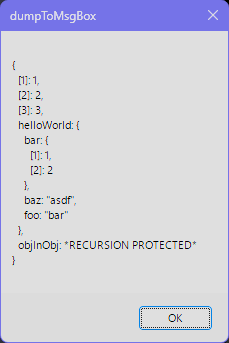

# Dumper
An AutoHotkey V2 variable dumping tool for debugging and development.


<p align="center" width="100%"></p>

## Motivation
In other languages I've grown accustomed to having nicely formatted indenting when debugging my applications. While I could get by with AHK's built-in `OutputDebug` or my editors debugger, I just found myself missing the ease of use of a `dump` or `console.log` type function. I also just really dislike the standard suggestion of "use `MsgBox()` or `ToolTip()`".

## Features
- nice indented formatting for objects
- console output
- string output
- MsgBox output
- Built-in GUI output
  - syntax highlighting
  - error capturing
  - remembers size and position
  - configurable stop on error
  - pause / resume
  - clear log
  - restart / exit app
  - can be auto added to your AHK systray
  - quiet dumps, silent but deadly
  - configurable hotkey
- recursion protection
- dump and exit app support
- customizable Console and GUI theme support

## Disclaimer
While you can use Dumper with AHK 2.0 the GUI requires 2.1 alpha. Don't be afraid of the AHK alpha build, in my experience there hasn't been any downsides to using it. If for some reason you can't run the alpha, it wouldn't be difficult to make the few syntax adjustments for AHK v2. I'm avoiding maintaining multiple versions until if/when someone becomes vocal about this.

## Examples
### GUI Output
```
#Include <ahk-dumper\RichDumper>

str := "foobar"
dumpGui(str)

>
"foobar"
```
### Console Output
```
#Include <ahk-dumper\Dumper>

str := "foobar"
dump(str)

>
"foobar"
```
```
i := 1234
dump(i)

>
1234
```
```
ary := [1, 2, 3]
dump(ary)

>
{
  [1]: 1,
  [2]: 2,
  [3]: 3
}
```
```
aryMap := Map("foo", "bar", "asdf", "jkl;")
dump(aryMap)

>
{
  ["asdf"]: "jkl;",
  ["foo"]: "bar"
}
```
```
obj := ary
obj.helloWorld := {
  foo: "bar",
  bar: [1, 2],
  baz: "asdf",
}
obj.objInObj := obj ;recursion protected
dump(obj)

>
{
  [1]: 1,
  [2]: 2,
  [3]: 3,
  helloWorld: {
    bar: {
      [1]: 1,
      [2]: 2
    },
    baz: "asdf",
    foo: "bar"
  },
  objInObj: *RECURSION PROTECTED*
}
```
### String Output
```
str := dumpString(obj)
MsgBox(str, "obj converted to string output")
```
### MsgBox Output
```
dumpMsgBox(obj)
```

### Dump and Exit App
```
dumpExit("asdf")

>
"asdf"
```
### Multiple Variables at Once
```
dump(str, i, ary, obj)

>
"foobar"
1234

...
```
## How To
### How should I include Dumper in my script?
There are two ways to include Dumper, choose only 1:
```
#Include <ahk-dumper\Dumper> ;minimalist, no GUI support, debug console support only
#Include <ahk-dumper\RichDumper> ;Includes GUI, requires 2.1 alpha
```
### Change GUI Theme
You can change the GUI theme by modifying the `richDumper := RichDump("dracula")` line at the top of the `RichDumper.ahk` file. Available options are `"dracula"` and `"vsCode"`... or make your own in the `RichThemes.ahk` file:
```
richDumper := RichDump('vsCode')
```
### Change Console Theme
You can change the console theme by modifying the `setTheme` section at the top of the `Dumper.ahk` file. Available options are `"dracula"` and `"vsCode"`... or make your own:
```
dump(values*) => Dumper().setTheme("vsCode").Call(values*)
```
### Add GUI to SysTray
By default the GUI will automatically open anytime you call `dumpGui()`. This can be handy if you're quietly dumping or you just want to get back to your log after closing it.
```
richDumper.addToSysTray()
```
### Disable GUI Error Reporting
Edit Richdumper.ahk and remove or comment out the `richDumper.enableErrorCapturing()` line
```
richDumper := RichDump("dracula")
;richDumper.enableErrorCapturing()
```
### Turn On Quiet Dumps
If you want to log dumps and look at the output later you can turn on quiet dumping.
```
richDumper.enableQuietDumps()
```
### Enable GUI Toggle Hotkey
If you're wafting in quiet dumps you might want to set a hotkey to make the GUI log more easily accessible. This method also accepts a `hotIfCallback` option.
```
richDumper.setHotkey("F1")
```
### GUI Fluent Option Chaining
All of these GUI options can be fluently chained like this:
```
 richDumper.enableQuietDumps().addToSysTray().setHotkey("F1", () {
   return WinActive("ahk_exe Code.exe")
 })
```
### See the output in VS Code
You'll need an AutoHotkey debugging extension. zero-plusplus's VS Code extension [[link](https://marketplace.visualstudio.com/items?itemName=zero-plusplus.vscode-autohotkey-debug)] is confirmed to work but others should work as well. Dumper doesn't do anything particuarly special. Any debugger that works with AHK's built-in `OutputDebug`[[link](https://www.autohotkey.com/docs/v2/lib/OutputDebug.htm)] function should work with Dumper.

Once a debugger extension is installed and configured `F5` will run your current `.ahk` file inside of VS Code. Find your "debug console" to see Dumper's output.
### I don't have the Fira Code font, where do I get it?
It's in the Resources\FiraCode font folder. Install it and you should be all set.
### I don't like the Fira Code font, I want to use another font.
That's fine, use whatever font you want but you'll have to adjust some values in the `RichThemes.ahk` file. If you don't adjust these the show/hide scrollbar functionality won't work correctly. Relevant variables:
```
  charWidth: 11,
  font: "Fira Code",
  fontSize: 14,
  lineHeight: 31,
```