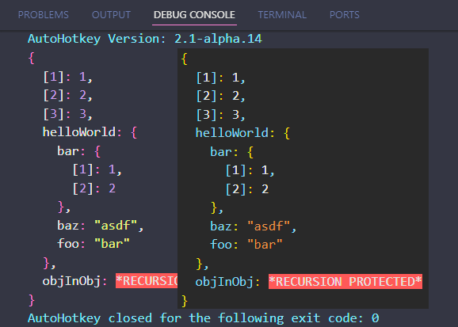
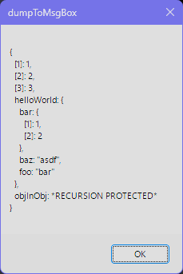

# Dumper
An AutoHotkey V2 variable dumping tool for debugging and development.


## Motivation
In other languages I've grown accustomed to having nicely formatted indenting when debugging my applications. While I could get by with AHK's built-in `OutputDebug` or my editors debugger, I just found myself missing the ease of use of a `dump` or `console.log` type function.

## Features
- nice indented formatting for objects
- console output
- string output
- MsgBox output
- recursion protection
- dump and exit app support
- customizable console theme support

## Examples
### Console Output
```
#Requires AutoHotkey v2.0
#Include <ahk-dumper\Dumper>

str := "foobar"
dump(str)

>
"foobar"
```
```
i := 1234
dump(i)

>
1234
```
```
ary := [1, 2, 3]
dump(ary)

>
{
  [1]: 1,
  [2]: 2,
  [3]: 3
}
```
```
obj := ary
obj.helloWorld := {
  foo: "bar",
  bar: [1, 2],
  baz: "asdf",
}
obj.objInObj := obj ;recursion protected
dump(obj)

>
{
  [1]: 1,
  [2]: 2,
  [3]: 3,
  helloWorld: {
    bar: {
      [1]: 1,
      [2]: 2
    },
    baz: "asdf",
    foo: "bar"
  },
  objInObj: *RECURSION PROTECTED*
}
```
### String Output
```
str := dumpToString(obj)
MsgBox(str, "obj converted to string output")
```
### MsgBox Output
```
dumpToMsgBox(obj)
```

### Dump and Exit App
```
dumpAndExit("asdf")

>
"asdf"
```
### Multiple Variables at Once
```
dump(str, i, ary, obj)

>
"foobar"
1234

...
```
## How To
### Change Theme
You can change the console theme by modifying the `setTheme` section at the top of the `Dumper.ahk` file. Available options are `"dracula"` and `"vsCode"`... or make your own:
```
dump(values*) => Dumper().setTheme("vsCode").Call(values*)
```
### See the output in VS Code
You'll need an AutoHotkey debugging extension. zero-plusplus's VS Code extension [[link](https://marketplace.visualstudio.com/items?itemName=zero-plusplus.vscode-autohotkey-debug)] is confirmed to work but others should work as well. Dumper doesn't do anything particuarly special. Any debugger that works with AHK's built-in `OutputDebug`[[link](https://www.autohotkey.com/docs/v2/lib/OutputDebug.htm)] function should work with Dumper.

Once a debugger extension is installed and configured `F5` will run your current `.ahk` file inside of VS Code. Find your "debug console" to see Dumper's output.
